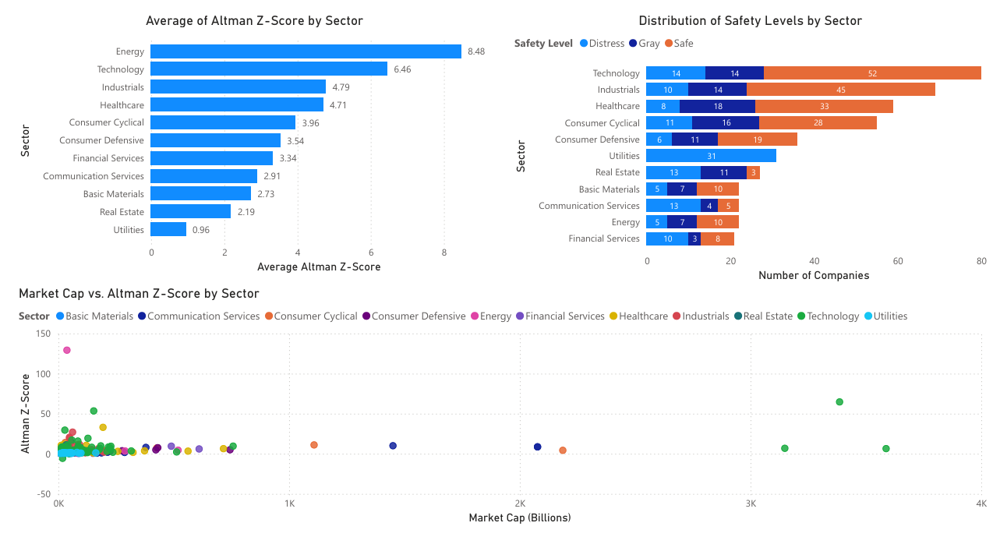

# SP500 Altman Z-Score Analysis by Sector and Market Capitalization

## Table of Contents

- [Project Overview](#project-overview)
- [Business Questions](#business-questions)
- [Data Sources](#data-sources)
- [Tools](#tools)
- [Data Cleaning/Preparation](#data-cleaningpreparation)
- [Exploratory Data Analysis](#exploratory-data-analysis)
- [Results/Findings](#resultsfindings)
- [Conclusions](#conclusions)
- [Challenges](#challenges)
- [Cool Techniques](#cool-techniques)
- [What Else I Might Have Done](#what-else-i-might-have-done)

### Project Overview
---

This data analysis project investigates the financial health of sectors within the S&P 500 using the Altman Z-Score, a metric used to assess a company's likelihood of bankruptcy. The analysis focuses on understanding how different sectors within the S&P 500 perform in terms of financial health, and how market capitalization influences the Z-Scores within those sectors. The project uses Python to clean, process, and analyze financial data, and Power BI to create visual dashboards that help interpret the findings.



### Business Questions
---

1. Which sectors within the S&P 500 exhibit higher overall Altman Z-Scores, indicating stronger financial health?
2. How does market capitalization influence Altman Z-Scores within different sectors of the S&P 500?

### Data Sources
---

The primary data source for this analysis is Yahoo Finance, which provides historical financial data for companies in the S&P 500 index. The dataset includes key financial metrics such as total assets, current assets, total liabilities, earnings before interest and tax (EBIT), and sales, which are required to compute the Altman Z-Score.

### Tools
---

- **Python**: Used for data cleaning, processing, and analysis.
  - Libraries: Pandas, NumPy, Matplotlib, Seaborn
- **Power BI**: Used to create interactive dashboards for visualizing the Z-Scores across sectors and their relationship with market capitalization.
- **Yahoo Finance**: Data source for financial metrics of S&P 500 companies.

### Data Cleaning/Preparation
---

In the data preparation phase, the following tasks were performed:
1. **Data Loading**: Retrieved financial data from Yahoo Finance using Python library `yfinance`.
2. **Handling Missing Data**: Missing values in key financial metrics were either filled with averages or removed where necessary.
3. **Feature Engineering**: Calculated the Altman Z-Scores for each company in the S&P 500 using the formula, and categorized the companies by sector.

### Exploratory Data Analysis
---

Exploratory Data Analysis (EDA) was performed to answer these questions, focusing on:
- Identifying sectors with stronger financial health based on Altman Z-Scores.
- Investigating how different market capitalization ranges correlate with Z-Scores across sectors.
- Analyzing the distribution of Z-Scores across all sectors to identify patterns and outliers.

### Results/Findings
---

1. **Sectors with Stronger Financial Health**: The **Technology**, **Healthcare**, **Industrials**, and **Energy** sectors exhibit the highest average Altman Z-Scores, indicating superior financial health relative to other sectors in the S&P 500.
2. **Market Capitalization and Z-Scores**: Companies with larger market capitalizations tend to have higher Altman Z-Scores, suggesting that larger firms are generally more financially stable.
3. **Sector Variability**: Certain sectors, such as **Financial Services** and **Technology**, display a broader range of Z-Scores, indicating greater variability in financial health within these industries.
4. **Strongest Correlation Between Market Cap and Z-Scores**: The **Communication Services** sector shows the highest correlation between market capitalization and Altman Z-Scores. This indicates that, within this sector, larger companies tend to exhibit more consistent financial stability, as reflected by their Z-Scores.

### Conclusions
---

- **Key Takeaway**: Larger companies in financially healthy sectors, like Technology and Healthcare, tend to have better Altman Z-Scores. This is useful for investors looking to assess sector-based stability in their portfolios.
- The analysis reveals that financial health, as measured by the Z-Score, varies significantly across different sectors and is influenced by company size (market capitalization).

### Challenges
---

- **Data Quality**: Some companies within the S&P 500 had incomplete or missing data for certain financial metrics, requiring extra steps for data imputation or removal.
- **Sector Classification**: Many companies belong to multiple sectors, making it difficult to categorize them into a single sector. Some level of manual classification was necessary.

### Cool Techniques
---
```
def scale_market_cap(market_cap):
    if market_cap is None:
        return 'N/A'
    try:
        return round(market_cap / 1e9, 2)
    except Exception:
        return 'N/A'
```


### What Else I Might Have Done
---

- **Sector-Specific Insights**: With more time, a deeper dive into the performance of specific companies within each sector could yield more granular insights.
- **Modeling Predictions**: If time allowed, machine learning models could be applied to predict future Z-Scores or bankruptcy risk based on financial metrics and historical performance.
- **Incorporating Macroeconomic Factors**: Including macroeconomic variables (such as interest rates or GDP growth) could add depth to the analysis, providing context for sector-wide financial health.
- **More Stocks**: While the S&P 500 is a key benchmark for the U.S. stock market, it doesn't represent the entire market. The analysis focuses on large-cap companies, but smaller-cap stocks, mid-cap stocks, and those outside of the S&P 500 may exhibit different financial characteristics.

---

